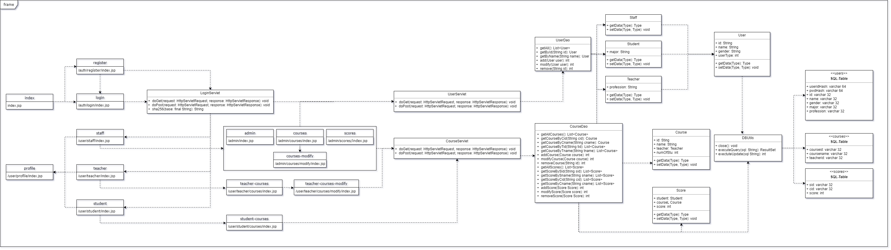

## 工程结构

### 目录树

```
│  .gitignore
│  HIT-CS33114-final-assignment.iml
│  README.md
│
├─.idea
│  │  .gitignore
│  │  misc.xml
│  │  modules.xml
│  │  runConfigurations.xml
│  │  saveactions_settings.xml
│  │  uiDesigner.xml
│  │  vcs.xml
│  │  workspace.xml
│  │
│  └─artifacts
│          HIT_CS33114_final_assignment_war_exploded.xml
│
├─docs
│  │  intro.md
│  │  report.md
│  │  大作业任务.doc
│  │  大作业分组.xls
│  │  大作业报告.doc
│  │
│  └─img
│          education-system.drawio
│          education-system.png
│
├─lib
│      mysql-connector-java-8.0.26.jar
│
├─src
│  └─cn
│      └─edu
│          └─hit
│              └─edusys
│                  ├─controller
│                  │      CourseServlet.java
│                  │      LoginServlet.java
│                  │      UserServlet.java
│                  │
│                  ├─dao
│                  │  │  CourseDao.java
│                  │  │  UserDao.java
│                  │  │
│                  │  └─impl
│                  │          CourseDaoImpl.java
│                  │          UserDaoImpl.java
│                  │
│                  ├─entity
│                  │  ├─course
│                  │  │      Course.java
│                  │  │      Score.java
│                  │  │
│                  │  └─user
│                  │          Staff.java
│                  │          Student.java
│                  │          Teacher.java
│                  │          User.java
│                  │
│                  └─utils
│                          DBUtils.java
│
└─web
    │  index.jsp
    │
    ├─admin
    │  │  index.jsp
    │  │
    │  └─courses
    │      │  index.jsp
    │      │
    │      ├─modify
    │      │      index.jsp
    │      │
    │      └─scores
    │              index.jsp
    │
    ├─auth
    │  ├─login
    │  │      index.jsp
    │  │
    │  └─register
    │          index.jsp
    │
    ├─user
    │  ├─profile
    │  │      index.jsp
    │  │
    │  ├─staff
    │  │      index.jsp
    │  │
    │  ├─student
    │  │  │  index.jsp
    │  │  │
    │  │  └─courses
    │  │          index.jsp
    │  │
    │  └─teacher
    │      │  index.jsp
    │      │
    │      └─courses
    │          │  index.jsp
    │          │
    │          └─modify
    │                  index.jsp
    │
    └─WEB-INF
        │  web.xml
        │
        ├─classes
        │  └─cn
        │      └─edu
        │          └─hit
        │              └─edusys
        │                  ├─controller
        │                  │      CourseServlet.class
        │                  │      LoginServlet.class
        │                  │      UserServlet.class
        │                  │
        │                  ├─dao
        │                  │      CourseDao.class
        │                  │      ScoreDao.class
        │                  │      UserDao.class
        │                  │
        │                  ├─entity
        │                  │  ├─course
        │                  │  │      Course.class
        │                  │  │      Score.class
        │                  │  │
        │                  │  └─user
        │                  │          Staff.class
        │                  │          Student.class
        │                  │          Teacher.class
        │                  │          User.class
        │                  │
        │                  └─utils
        │                          DBUtils.class
        │
        └─lib
                mysql-connector-java-8.0.26.jar
```

### 流程图



## 接口、方法说明

### `cn.edu.hit.edusys.controller.*`

#### `LoginServlet`

用于处理关于登录信息的请求；维护系统的安全。

#### `UserServlet`

用于处理关于用户信息的请求。

#### `CourseServlet`

用于处理关于课程信息的请求。

### `cn.edu.hit.edusys.entity.*`

#### `User`类：

`User`类是所有用户类的基类，包含每个用户的编号、姓名、性别和用户类型，以及其`Getter`和`Setter`方法。

| 字段                   | 说明                                                         |
|------------------------|--------------------------------------------------------------|
| `private String id;`     | 用户的编号、学号。                                           |
| `private String name;`   | 用户的姓名。                                                 |
| `private String gender;` | 用户的性别。                                                 |
| `private int userType;`  | 用户的类型。<br>错误的类型值输入需抛出`IllegalArgumentException`异常 |

`userType`值与用户类类型对应关系如下：

| 值 | 对应类 |
|----|----------|
| `0`  | `Staff`   |
| `1`  | `Teacher`  |
| `2`  | `Student`  |

#### `Staff`类：

`Staff`类是管理员类，完全继承自`User`类，没有额外字段。

#### `Teacher`类：

`Teacher`类是教师类，有额外字段`private String profession;`表示其研究方向。

#### `Student`类：

`Student`类是学生类，有额外字段`private String major;`表示其所属专业。


### `cn.edu.hit.edusys.dao.*`

#### `UserDao`接口：

`UserDao`用以操作、查询数据库中所有用户的信息，包括`Staff`, `Teacher`和`Student`。

| 接口原型                            |  说明                     |
|---------------------------------------|--------------------------|
| `public User getById(String id);`     | 以`id`获取单个用户。     |
| `public User getByName(String name);` | 以名字`name`获取单个用户 |
| `public int add(User user);`          | 添加一个用户。           |
| `public int modify(User user);`       | 修改一个用户。           |
| `public int remove(String id);`       | 移除一个用户。           |


#### `CourseDao`接口：

`CourseDao`用以操作和查询数据库中所有课程信息，和所有学生关于其课程的得分记录。

| 接口原型                                              | 说明                                            |
|-------------------------------------------------------|-------------------------------------------------|
| `public List<Course> getAllCourses();`                | 获取所有课程。                                  |
| `public Course getCourseByCid(String cid);`           | 以课程`id`获取一个课程。                        |
| `public Course getCourseByCname(String cname);`       | 以课程名`cname`获取一个课程。                   |
| `public List<Course> getCourseByTid(String tid);`     | 以任课教师的`id`获取一个课程。                  |
| `public List<Course> getCourseByTname(String tname);` | 以任课教师姓名`tname`获取一个课程。             |
| `public int addCourse(Course course);`                | 添加一个课程。                                  |
| `public int modifyCourse(Course course);`             | 修改一个课程。                                  |
| `public int removeCourse(String id);`                 | 移除一个课程。                                  |
| `public List<Score> getAllScores();`                  | 获取所有得分记录。                              |
| `public List<Score> getScoreBySid(String sid);`       | 以学号`sid`获取一个学生所有课程的得分。         |
| `public List<Score> getScoreBySname(String sname);`   | 以姓名`sname`获取一个学生所有课程的得分。       |
| `public List<Score> getScoreByCid(String cid);`       | 以课程`cid`获取一个课程下所有学生的得分。       |
| `public List<Score> getScoreByCname(String cname);`   | 以课程名称`cname`获取一个课程下所有学生的得分。 |
| `public int addScore(Score Score);`                   | 添加一条得分记录。                              |
| `public int modifyScore(Score score);`                | 修改一条得分记录。                              |
| `public int removeScore(Score Score);`                | 移除一条得分记录。                              |

### `cn.edu.hit.edusys.utils.*`

#### `DBUtils`

| 字段与方法名                                      | 解释                 |
|---------------------------------------------------|----------------------|
| `static final String JDBC_DRIVER;`                  | JDBC驱动名           |
| `static final String DB_URL;`                       | 数据库地址           |
| `static final String USER;`                         | 数据库登录用户       |
| `static final String PASS;`                         | 数据库登录密码       |
| `private static Connection con;`                    | 获取链接             |
| `private static Statement stmt;`                    |                      |
| `public static ResultSet executeQuery(String sql);` | 获取查询语句的结果集 |
| `public static int executeUpdate(String sql);`      | 更新数据库           |
| `public static void close();`                       | 关闭连接             |
